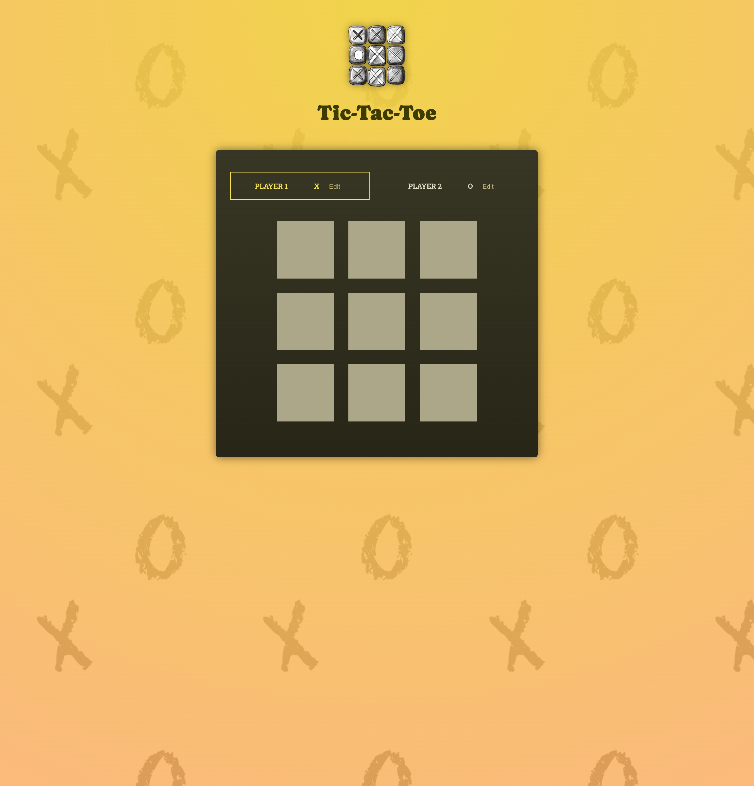
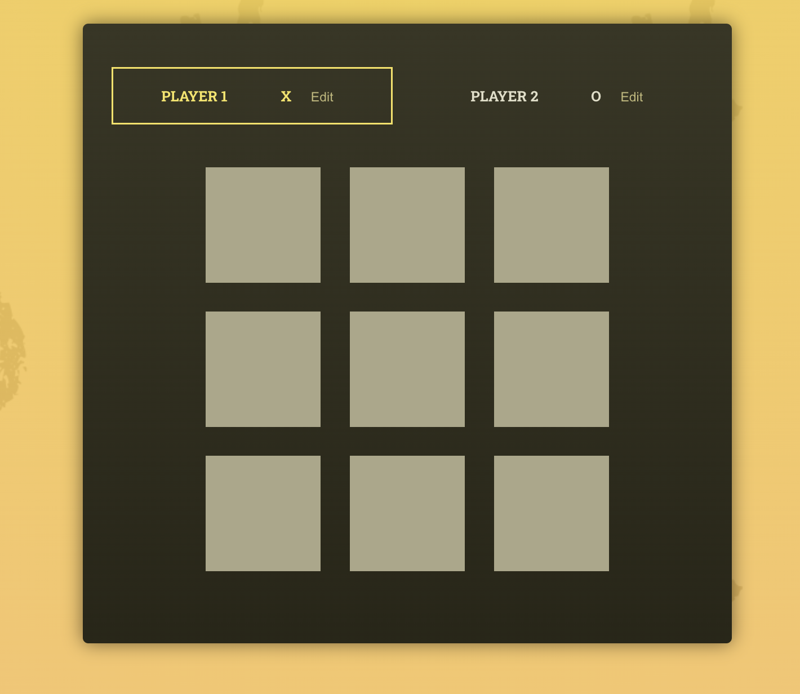
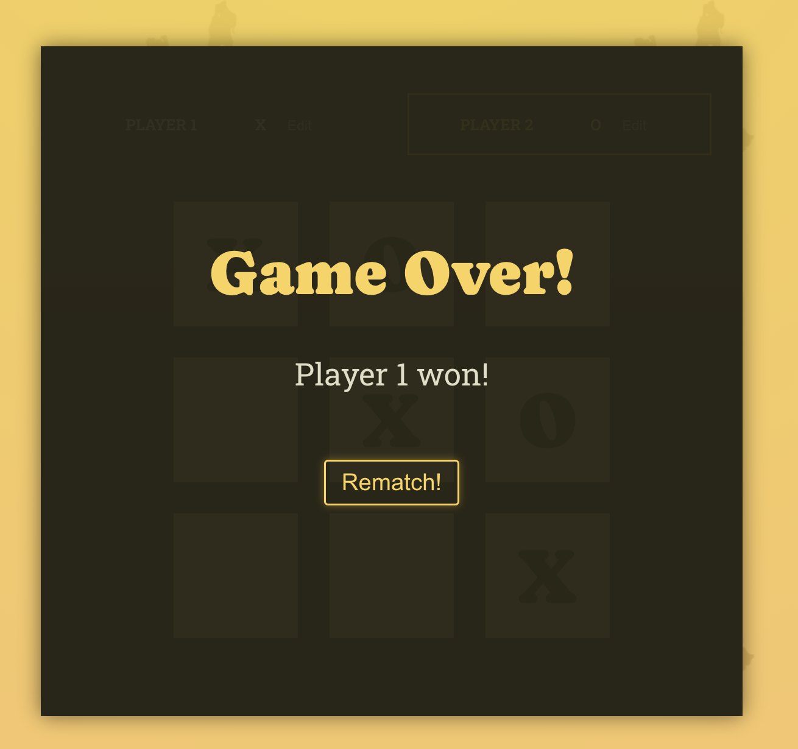

# Tic Tac Toe Oyunu

## 🎯 Genel Bakış

React kullanılarak geliştirilmiş bir Tic Tac Toe (XOX) oyunu. İki oyuncu sırasıyla 3x3'lük bir tahtada kareler seçerek oynayabilir. Oyunun sonunda kazanan ya da berabere durumu belirlenir.

## 🛠️ Kullanılan Teknolojiler

- **React**
- **JavaScript**
- **CSS**

## 🚀 Özellikler

- 3x3 oyun tahtası
- İki oyunculu oyun
- Hamlelerin kaydını tutma
- Kazanan veya berabere durumunu gösterme
- Tekrar oynama seçeneği
- Oyuncu İsmi Düzenleme: Oyuncular isimlerini düzenleyebilir ve kaydedebilir (Edit ve Save özelliği)

## 🕹️ Nasıl Oynanır

1. Oyun sırası belirlenen oyuncuyla başlar.
2. Oyuncular sırayla bir kare seçer.
3. Yatay, dikey veya çapraz 3 sembolü hizalayan oyuncu kazanır.
4. Tüm kareler dolduğunda kazanan yoksa oyun berabere sonuçlanır.

## 📸 Ekran Görüntüleri



- **Oyun Tahtası**
  

- **Kazanan Oyuncu**
  

## ⚙️ Kurulum ve Çalıştırma

1. Bu projeyi klonlayın:
   ```bash
   git clone <https://github.com/busracogul/tic-tac-toe.git>
   cd tic-tac-toe
   ```
2. Bağımlılıkları yükleyin:
   ```bash
   npm install
   ```
3. Geliştirme sunucusunu başlatın:
   ```bash
   npm run dev
   ```
4. Uygulamayı tarayıcınızda görüntüleyin:
   ```bash
   http://localhost:5173
   ```

## Canlı Proje Linki

Projeyi canlıda görmek için [buraya tıklayın](https://tic-tac-toe-game-project-react.vercel.app).
